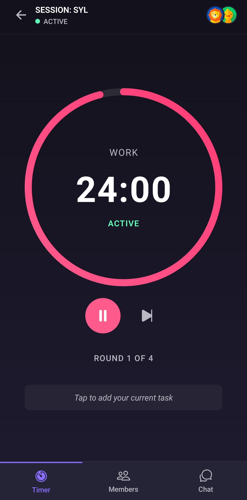
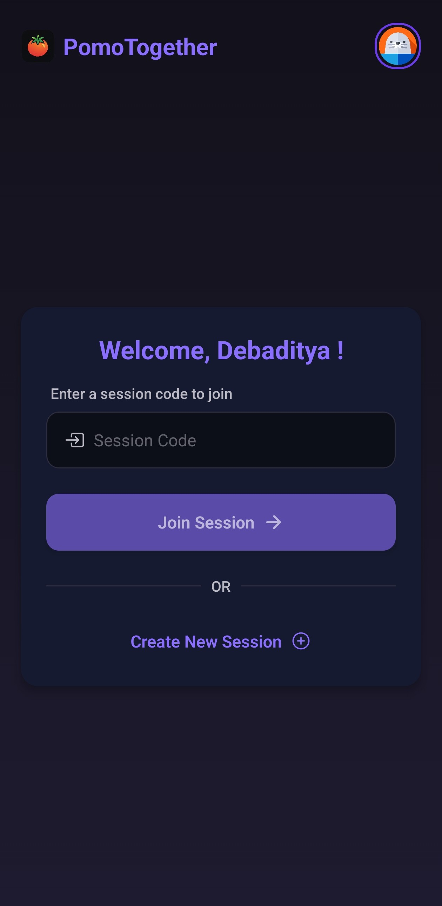
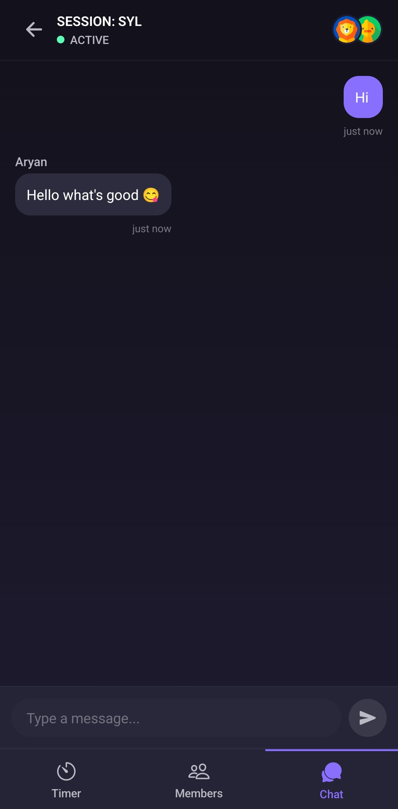

# SharedPomo

<div align="center">
  
  <p><em>Collaborative Pomodoro Timer App</em></p>
</div>

## 📱 Overview

SharedPomo is a collaborative Pomodoro timer app that allows users to create and join focused work sessions with friends, colleagues, or study groups. Stay productive together, even when physically apart!



## ✨ Features

- **Shared Timer Sessions**: Create or join timer sessions with a simple code
- **Customizable Settings**: Configure work duration, break length, number of rounds, and long breaks
- **Real-time Synchronization**: Everyone in the session sees the same timer
- **Chat Feature**: Communicate with session participants without leaving the app
- **Participant Management**: See who's in your session with real-time participant list
- **Task Input**: Add and track tasks to complete during your Pomodoro sessions
- **Dark/Light Theme**: Choose your preferred visual style
- **Notifications**: Get notified when work periods and breaks start/end
- **Persistent Username**: Your username is remembered for future sessions
- **Cross-Platform**: Works on iOS and Android devices
- **Haptic Feedback**: Tactile responses for user interactions

## 🚀 Getting Started

### Prerequisites

- [Node.js](https://nodejs.org/) (v16 or newer)
- [npm](https://www.npmjs.com/) or [yarn](https://yarnpkg.com/)
- [Expo CLI](https://docs.expo.dev/get-started/installation/)

### Installation

1. Clone the repository
   ```bash
   git clone https://github.com/yourusername/SharedPomo.git
   cd SharedPomo
   ```

2. Install dependencies
   ```bash
   npm install
   # or
   yarn install
   ```

3. Start the development server
   ```bash
   npm start
   # or
   yarn start
   ```

4. Follow the Expo CLI instructions to run on a device or emulator

### Building APKs

To build an Android APK:

```bash
npm run build:android-apk
# or
eas build --platform android --profile development --local
```

For a production build:
```bash
npm run build:android
# or
eas build --platform android --profile preview
```

## 🧰 Tech Stack

- [React Native](https://reactnative.dev/) - Cross-platform mobile framework
- [Expo](https://expo.dev/) - React Native platform and toolchain
- [Expo Router v4](https://docs.expo.dev/router/introduction/) - File-based routing
- [Firebase](https://firebase.google.com/) - Backend and real-time database
- [React Context API](https://react.dev/reference/react/createContext) - State management
- [Expo Notifications](https://docs.expo.dev/versions/latest/sdk/notifications/) - Push notifications
- [AsyncStorage](https://react-native-async-storage.github.io/async-storage/) - Local data persistence
- [Expo Haptics](https://docs.expo.dev/versions/latest/sdk/haptics/) - Tactile feedback

## 📝 How It Works

1. **Create or Join**: Start a new Pomodoro session or join an existing one with a session code
2. **Set Parameters**: Customize work time, break time, and number of rounds
3. **Work Together**: Stay in sync with all participants as you work through focused intervals
4. **Communicate**: Chat with participants directly in the app
5. **Stay Motivated**: Seeing others in your session helps maintain accountability

## 📸 Screenshots

<div align="center">
  
  
  
</div>

## 🛠️ Development

### Project Structure

```
SharedPomo/
├── app/                  # Expo Router-based navigation
│   ├── index.tsx         # Home screen
│   ├── session.tsx       # Session screen
│   └── (tabs)/           # Tab navigation
├── assets/               # Static assets (images, fonts)
├── components/           # Reusable React components
│   ├── SessionSetup.tsx  # Session configuration
│   ├── TimerCircle.tsx   # Circular timer component
│   ├── SessionChat.tsx   # Chat functionality
│   ├── ParticipantList.tsx # Session participants
│   └── ui/               # UI components
├── context/              # React Context providers
│   ├── SessionContext.tsx # Session state management
│   └── ThemeContext.tsx  # Theme state management
├── services/             # Firebase and other service integrations
├── constants/            # App-wide constants
├── styles/               # Shared styles
├── hooks/                # Custom React hooks
└── utils/                # Helper functions
```

### Available Scripts

- `npm start` - Start the Expo development server
- `npm run android` - Run on Android device/emulator
- `npm run ios` - Run on iOS simulator
- `npm run build:android` - Build Android preview
- `npm run build:android-apk` - Build Android APK for development
- `npm run reset-project` - Reset project cache
- `npm run lint` - Run linter

## 🔒 Privacy & Security

SharedPomo respects user privacy:
- No user account required
- Minimal data collection
- Session data is temporary and deleted after session end
- Firebase Firestore used for real-time session synchronization
- Automated session cleanup for inactive sessions

## 🤝 Contributing

Contributions are welcome! Please feel free to submit a Pull Request.

1. Fork the repository
2. Create your feature branch (`git checkout -b feature/amazing-feature`)
3. Commit your changes (`git commit -m 'Add some amazing feature'`)
4. Push to the branch (`git push origin feature/amazing-feature`)
5. Open a Pull Request

## 📄 License

This project is licensed under the MIT License - see the LICENSE file for details.

## 📞 Contact

Project Link: [https://github.com/yourusername/SharedPomo](https://github.com/yourusername/SharedPomo)

---

<div align="center">
  <p>Made with ❤️ for productivity enthusiasts everywhere</p>
</div> 